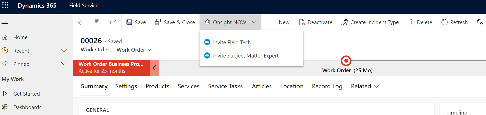
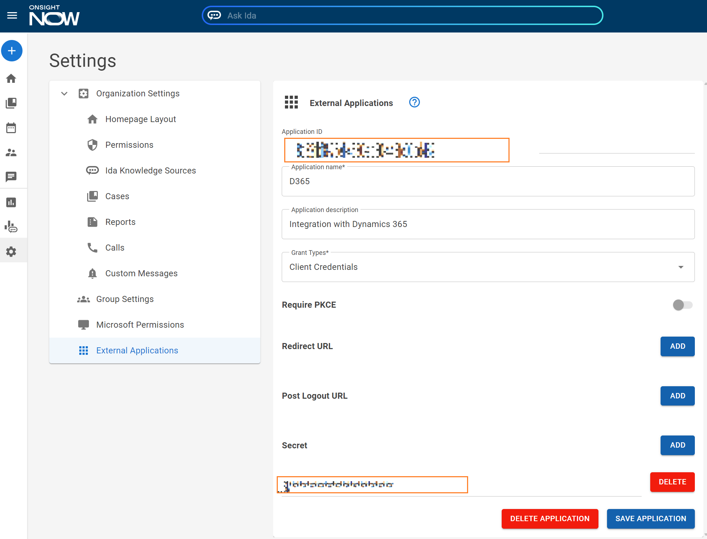

# Onsight NOW/Dynamics 365 Integration

## Overview

This solution provides basic integration between Onsight NOW and Dynamics 365 Field Service. It is designed to be a reference implementation and to serve as the basis for more complex integrations that an Onsight NOW customer may require.

This integration adds two buttons to the WorkOrder's "MainTab" user interface. These buttons allow the D365 user to initiate an "instant meeting" with either the Field Tech worker assigned to the WorkOrder, or with the Subject Matter Expert assigned to the WorkOrder:

## Pre-Install Setup

The Onsight NOW/Dynamics 365 Integration requires authentication with the Onsight NOW APIs. To configure authentication with Onsight NOW, you will need to register this integration with Onsight NOW as an "External Application".

1) As an Onsight NOW administrator, go to [Settings](https://app.onsightnow.com/settings) and select "External Applications".
2) Enter a name for this external integration (e.g., "D365") and a description.
3) In the _Grant Types_ field, select "Client Credentials".
4) Next to "Secret", click Add. You will need to copy this generated Secret value immmediately and keep it for the Post-Install Setup below. Note that once you leave this page, the secret value will no longer be obtainable. If you lose this secret, a new one will need to be generated to replace it.
5) Save the Application. An "Application ID" (aka, the "Client ID") will be generated. Copy and retain this value, along with the Secret, for use in the Post-Install Setup below.

## Installing From Source

The integration is provided as an unmanaged solution. To install the solution into your D365 tenant, run the 'Build D365 Solution' GitHub Action. The artifact from this build will be a zip file, _OnsightNOWDynamics365FieldService.zip_, which can be directly imported into your D365 tenant. 

## Post-Install Setup

Once the solution has been installed into your D365 tenant, two environment variables must be initialized:

- **new_OnsightNowClientId**: the Client ID value obtained from Onsight NOW's External Application registration above.
- **new_OnsightNowClientSecret**: the Client Secret value obtained from Onsight NOW's External Application registration above.

> Note that these values are provided, by default, as type _Text_. Alternatively, you may change these variables to type _Secret_, which stores the values in an Azure Key Vault. The existing variables would need to be deleted and then re-added (reusing the same names) using the _Secret_ type. For more information on using _Secret_ environment variables, please [refer to the D365 documentation](https://learn.microsoft.com/en-us/power-apps/maker/data-platform/environmentvariables-azure-key-vault-secrets).

Additionally, three other environment variables may be **optionally** configured. If these two are not modified, the standard values will be used:
- **new_OnsightNowTokenEndpoint**: the Onsight NOW API Token URL.
- **new_OnsightNowMeetingsEndpoint**: the Onsight NOW Meetings API URL.
- **new_OnsightNowIdaEndpoint**: the Onsight NOW Ida Chat API URL.

## Components

The integration is composed of the following pieces:

### WorkOrder UI

The solution adds a flyout button to the "MainTab" UI of the WorkOrder entity (_msdyn_workorder_). This flyout has two child buttons: __Invite Field Tech__ and __Invite Subject Matter Expert__:

- **Invite Field Tech:** creates an instant meeting between the logged-in D365 user and the designated field worker. The designated field worker is, by default, the first BookableResourceBooking associated with the selected WorkOrder.
- **Invite Subject Matter Expert:** create an instant meeting between the logged-in D365 user and the designated subject matter expert. The Subject Matter Expert is inferred from the WorkOrder's Support Contact field.

### JavaScript Module (new_OnsightNowApi)

The [new_OnsightNow javascript module](solutions/OnsightNOWDynamics365FieldService/WebResources/new_OnsightNowApiB4063D5E-9601-EF11-9F89-002248B31AA4.js) contains _click_ event handling for the two buttons above. The main entry point is the function _onClick_ which gets called when either button is clicked by the user. The code, in turn, determines which button was clicked and performs look ups of both the D365 user's email along with the targeted person's email address. With these two email addresses, an Onsight NOW meeting is created and the current user's browser is redirected to the meeting (in a new tab).

### ScheduleNOWMeeting Action

A custom Action, __ScheduleNOWMeeting__, is provided as a "wrapper" around the __OnsightNow.DataversePlugin__, which is also included in this solution. The Action is invoked by the JavaScript UI code; in turn, the Action then invokes the DataversePlugin. This "wrapper" Action is required as it is the only way the Plugin can be triggered by the UI.

### OnsightNow.DataversePlugin

A Dataverse Plugin, __OnsightNow.DataversePlugin__ is included in the solution and performs the work of authentication and communication with the Onsight NOW APIs. As the Plugin runs within the context of a D365 sandbox, the Onsight NOW APIs can be used via the OIDC _client_credentials_ flow. This means that Onsight NOW Meetings can be created using a Client ID/Client Secret rather than requiring the D365 user to interactively login using the _authorization code flow_.

### Environment Variables

The four environment variables which were configured in the Post-Install Setup are read by the DataversePlugin each time authentication and/or communication with Onsight NOW is required.

## NOTES

> The _Ribbon Workbench_ tool was used to add the _Invite Field Tech_ and _Invite Subject Matter Expert_ buttons to the WorkOrder's UI. This tool, along with many other D365 customization tools, can be found in the [XrmToolBox app](https://www.xrmtoolbox.com/). _Ribbon Workbench_, however, has a strict requirement that entity UIs cannot be edited within solutions containing other customizations (e.g., WebResources, JavaScript modules, Actions, etc.). This means that this solution would need to be broken up into two smaller solutions, with the WorkOrder (and any other entities) in one solution, and everything else in another solution. The solution containing just the entities could then be loaded into _Ribbon Workbench_. Alternatively, the [_customizations.xml_](solutions/OnsightNOWDynamics365FieldService/customizations.xml) file could be manually edited.
